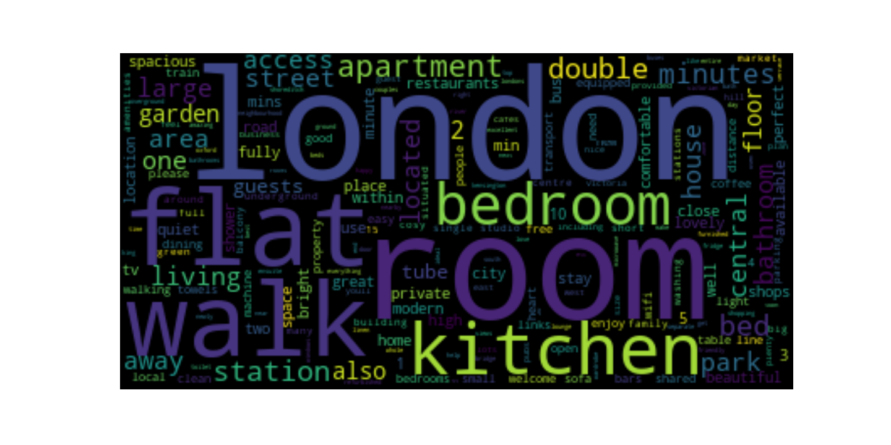

# airbnb
EDA for London Air bnb data nov18

# motivation for the roject
To gain a better insight into Airbnb . Using CrispDM analysis principles to answer a few high level questions (*listed below)

# Packages used 

```###import all here 
import pandas as pd
import requests
import seaborn as sns
from sklearn.preprocessing import StandardScaler
from sklearn.model_selection import train_test_split
from sklearn.metrics import mean_squared_error
import nltk
from nltk.corpus import stopwords
from sklearn.tree import DecisionTreeRegressor
import re 
import numpy as np
import matplotlib.pyplot as plt
from io import StringIO
from wordcloud import WordCloud
```
# Data source
http://data.insideairbnb.com/united-kingdom/england/london/2018-11-04/data/listings.csv.gz

# Questions asked?
- 1)Can we predict price? and what are the important features?
- 2)Can we predict review scores? and what are the important features?
- 3)What are the common words used in describing properties?

# results
-  Able to predict price within $8 per person median error - and get a useful list of feature importances below 

-   Able to predict price within 1.4%  median error - and get a useful list of feature importances below 

-  

